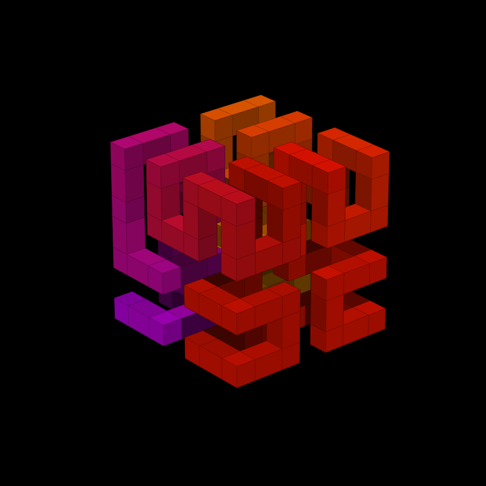

# Technical Blog

  

## About

Blog website about math, programming, and food. Initial prototype built from scratch using HTML5, CSS3, and vanilla JS. Migrated to Astro for portability and performance.

Visit website at [neumanncondition.com](https://neumanncondition.com/) or [hilbertcube.github.io](https://hilbertcube.github.io)

1.  [About](https://neumanncondition.com/about/)
2.  [Privacy Policy](https://neumanncondition.com/privacy-policy/)

## Tools used:

1. [Astro](https://astro.build/): static site generator
2. [Astro RSS](https://www.npmjs.com/package/@astrojs/rss): RSS generation
3. [KaTeX](https://katex.org/): display LaTeX math equations
4. [Shiki](https://shiki.style/): build-time code syntax-highlighting
5. [Pagefind](https://pagefind.app/): search system
6. [Yet Another React Lightbox](https://yet-another-react-lightbox.com/): smooth image lightbox
7. [Google Analytics](https://marketingplatform.google.com/about/analytics/): analyze page usage
8. [Playwright](https://playwright.dev/): headless-Chromium PDF export of articles
9. [GitHub Actions](https://github.com/features/actions): build and deploy

## Change Log

A history of the features, fixes, and smaller tweaks made over the life of the blog.

### 2026

- **Oct 2026:** Articles and posts now have a "Save as PDF" button
- **Oct 2026:** References are now typed, BibTeX-style entries in a `_references.ts` beside each article, rendered by `<References />` instead of hand-written citations.
- **Sep 2026:** New banners
- **Sep 2026:** Pages no longer wrap their body in `
` — the layout provides the content column, with a `hero` slot for full-width content above it.
- **Sep 2026:** Added a sitemap (`/sitemap-index.xml`) and a `robots.txt` pointing to it.
- **Sep 2026:** Tabbed code boxes are now keyboard- and screen-reader-accessible (arrow keys, Home/End, ARIA tab roles), and panes no longer need ids or hand-set `display: none`.
- **Sep 2026:** Code blocks can now be indented to match the page (`is:raw`), with `<` and `{` written as-is instead of escaped.
- **Sep 2026:** [MAJOR] Replaced Prism.js with build-time Shiki highlighting: no highlighting scripts or CDN requests, and code themes now switch instantly without a reload.
- **Sep 2026:** Moved the image lightbox to yet-another-react-lightbox, loaded only on the first image click
- **Aug 2026:** [MAJOR] Upgraded TOC highlighting
- **Aug 2026:** Replaced the hand-run RSS generation script with a build-time Astro endpoint sourced from the article/post collections.
- **Aug 2026:** Updated logo and favicon
- **Aug 2026:** [MAJOR] Added smart Table of Contents
- **Aug 2026:** [MAJOR] Replaced MathJax with self-hosted KaTeX for faster math rendering, added escape-free display and inline math components backed by a `tex` template helper.
- **Jul 2026:** Added a new tag button and edited the About page.
- **Jul 2026:** Consolidated archive tags into the search bar.
- **Jul 2026:** [MAJOR] Site redesign.
- **Jul 2026:** Fixed a meta-return issue and a dark-mode caching issue.
- **Jul 2026:** Changed the top-bar layout and fixed equation formatting.
- **Jul 2026:** [MAJOR] Reinvented and implemented a new search system (Pagefind).
- **May 2026:** Updated inline-code styling.
- **May 2026:** Published the "Debugging and Profiling with Valgrind" article.
- **Mar 2026:** Updated the navigation bar and fixed an equation-render issue.
- **Mar 2026:** Compressed images, cleaned up, and removed unused scripts and assets.
- **Mar 2026:** Rebuilt the lightbox mechanism and componentized the codebase.
- **Mar 2026:** Resolved runtime load issues and added render-priority hints.
- **Mar 2026:** Lighthouse performance pass: bundled CSS, `font-display: swap`, and resized images.
- **Mar 2026:** Rewrote scripts for Astro and fixed the dark-mode flash and mobile sidebar flash.
- **Mar 2026:** Fixed the GitHub API repo name and the deploy workflow (trigger on `main`).
- **Mar 2026:** [MAJOR] Migrated the entire site from the hand-built prototype to the Astro static site generator, with GitHub Pages deployment.
- **Feb 2026:** Monthly content updates and About/Linux post edits.
- **Jan 2026:** Reworked the table-of-contents script and expanded notes/content.

### 2025

- **Dec 2025:** Added lines-of-code calculation logic and a new Bash feature/script.
- **Nov 2025:** Added ARIA labels to buttons for accessibility.
- **Nov 2025:** Fixed GitHub Pages deployment (disabled Jekyll) and organized CSS.
- **Nov 2025:** Added a GitHub Actions workflow that auto-fetches the latest commit info.
- **Nov 2025:** Automated RSS generation and added supporting scripts.
- **Jul 2025:** Fixed a Firefox list-render error and updated the About page.
- **May 2025:** Reworked GitHub Actions deployment.
- **May 2025:** Added in-article image navigation and expanded content.
- **Apr 2025:** Added a project license, and fixed icons and the search bar.
- **Apr 2025:** Moved commit history into a sidebar, powered by the GitHub API.
- **Apr 2025:** Added a settings window and adjusted the default theme.
- **Apr 2025:** Added image viewing / lightbox.
- **Apr 2025:** Added the archive page.
- **Apr 2025:** Added an RSS feed (XML).
- **Apr 2025:** [MAJOR] Reworked and enhanced the search system.
- **Apr 2025:** Converted article images to WebP.
- **Apr 2025:** Removed jQuery.
- **Apr 2025:** Optimized load times and changed the loading logic.
- **Mar 2025:** [MAJOR] First major redesign, with shared top navigation loaded across all pages and a restructured JS file layout.
- **Jan 2025:** Front-page updates and minor content changes.

### 2024

- **Dec 2024:** Mobile layout changes and default-width adjustments.
- **Dec 2024:** Integrated Google Analytics for page-usage tracking.
- **Nov 2024:** Updated the privacy policy and fixed tab-handling issues.
- **Nov 2024:** Set up CNAME and root-directory redirects for the custom domain.
- **Nov 2024:** Added a custom 404 page (with several follow-up fixes).
- **Nov 2024:** Added table-of-contents scroll highlighting.
- **Oct 2024:** Added README, fixed the favicon, and adjusted fonts and link flexibility.
- **Oct 2024:** Added the first articles, including Snell's law, plus an animated canvas banner.
- **Oct 2024:** [MAJOR] Initial launch. Blog built from scratch with HTML5, CSS3, and vanilla JS.

## Creation

This website was created on June 20, 2024, but most information
here have been available since December 2022 via LaTeX documents
made by me.